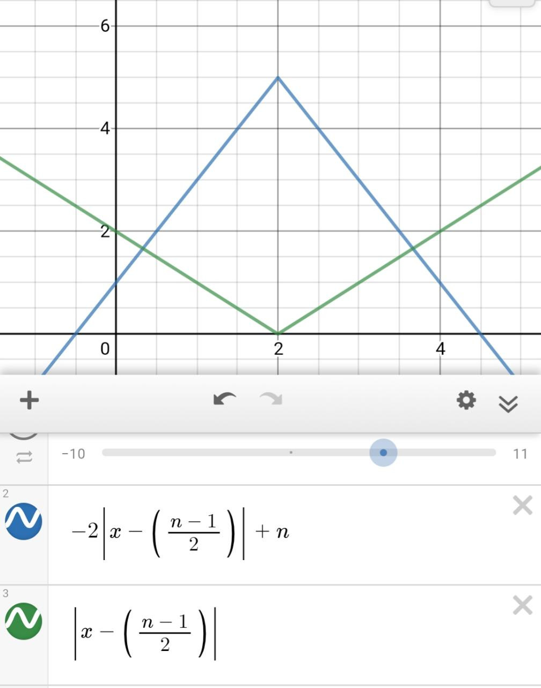

## First Approach - Trial And Error
The question looked pretty easy, therefore I tried just going in blindly, which ended up badly. The code barely passed any tests, and was prone to bugs.

## Second Approach - Math
I decided to take a step back and analyze the question further, and I realized that the spaces and width of the diamond at each layer followed a pattern:

```
s d
0 1  *

1 1   *
0 3  ***
1 1   *

2 1   *
1 3  ***
0 5 *****
1 3  ***
2 1   *

3 1    *
2 3   ***
1 5  *****
0 7 *******
1 5  *****
2 3   ***
3 1    *
```

From this, you can deduce that there is a formula to map the spaces and width of a diamond `n` at each layer

## Creating the formula

Assuming you have a formula `f(x)`, you can do:
- Horizontal displacement by `h`: `f(x - h)` 
- Vertical displacement by `a`: `f(x) + a` 

Combining the two, you can create a function, `f(x - h) + a`

From the comment, you can see that 



Where n is the size of the diamond:
- The blue line represents the width of the diamond in each line
- The green line represents the spaces before the width in each line
- `(n - 1) / 2` is the middle of the diamond
- the lines start at `0` and end at `n - 1`, AKA `0 <= l < n`, Starting from 1 is also possible
